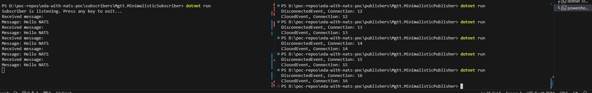

# eda-with-nats-poc

## Table of Contents

+ [Summary](#summary)
+ [References](#references)
+ [Features](#features)
+ [Getting started](#getting-started)

## Summary

Minimalistic proof of concept for event-driven architecture (EDA) using NATS

## References

- [nats.net Github repository](https://github.com/nats-io/nats.net)
- [NATS and Docker](https://docs.nats.io/running-a-nats-service/nats_docker)

## Features

- [x] Showcase pub-sub messaging trough NATS broker
- [ ] Showcase pub-sub messaging with security mechanisms using TLS and authentication through a NATS broker

## Getting started

### Preconditions

- [Install Docker Engine](https://docs.docker.com/engine/install/)

### Minimalistic setup

0. Ramp up local Docker Compose cluster:

```sh
docker-compose up -d --build
```

1. Launch the subscriber application in a terminal process:

```sh
cd subscribers/Mgtt.MinimalisticSubscriber
dotnet run
```

2. Initiate the publisher application in a separate terminal process:

```sh
cd publishers/Mgtt.MinimalisticPublisher
dotnet run
```

3. Observe that the subscriber successfully receives the submitted event. Results should resemble the following:



4. Terminate the subscriber application by pressing any key and remove resources of the local Docker Compose cluster:

```sh
docker-compose down -v
```

### Setup with TLS encryption and authentiation

0. Renew cryptographic material (self signed certs and private keys) as outlined in the [README.md](./certs/README.md) if necessary due to expiration

1. Ramp up local Docker Compose cluster:

```sh
docker-compose -f docker-compose.nats-with-tls-and-auth.yml up -d --build
```

2. Launch the subscriber application in a terminal process:

```sh
cd subscribers/Mgtt.SubscriberWithTlsAndAuth
dotnet run
```

3. Initiate the publisher application in a separate terminal process:

```sh
cd publishers/Mgtt.PublisherWithTlsAndAuth
dotnet run
```

4. Observe that the subscriber successfully receives the submitted event. Results should resemble the following:


5. Terminate the subscriber application by pressing any key and remove resources of the local Docker Compose cluster:

```sh
docker-compose down --file docker-compose.nats-with-tls-and-auth.yml -v
```